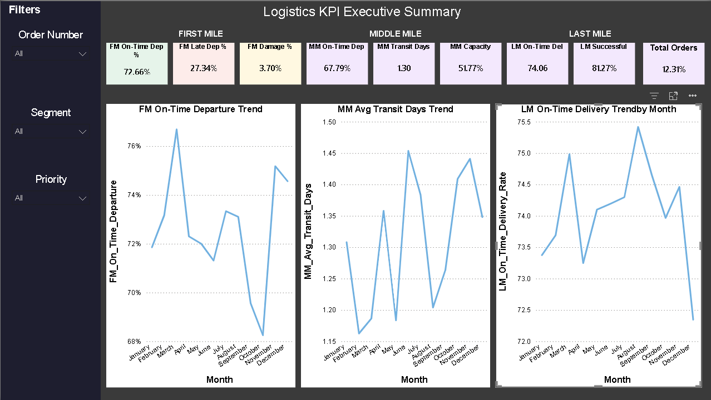
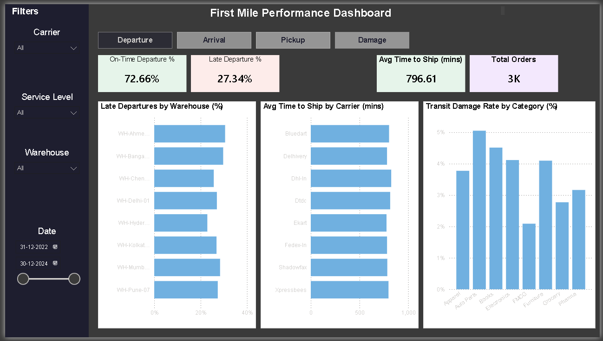
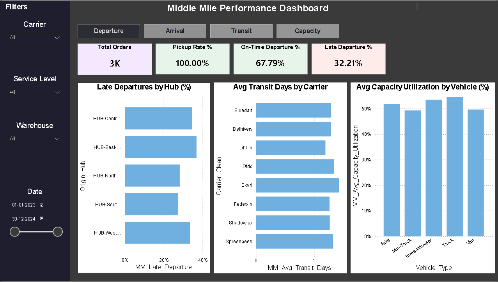
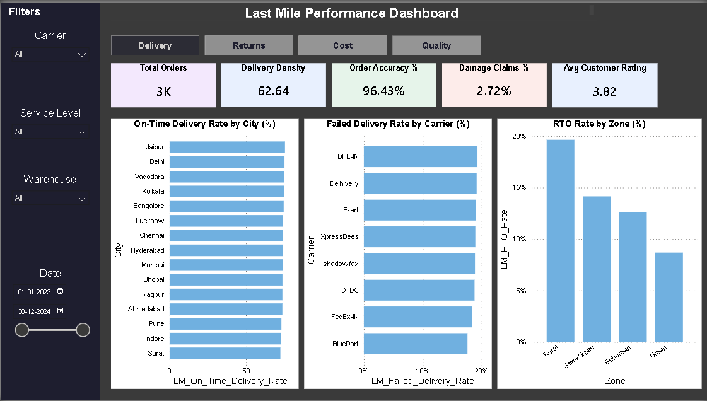

# Logistics KPI Dashboard — Power BI

A comprehensive **3-tier logistics performance dashboard** built in Power BI, tracking operational KPIs across First Mile, Middle Mile and Last Mile delivery stages.

---

## Dashboard Pages

### Executive Summary
Bird's eye view of all three mile stages in a single page — key KPIs per stage with monthly trend lines for on-time performance and transit efficiency.

### First Mile — Warehouse to Hub
Tracks warehouse dispatch and pickup performance with tabbed KPI views:
- On-Time & Late Departure Rate (15-min threshold)
- On-Time & Late Arrival Rate
- Pickup Rate & Late Pickup Rate
- Transit Damage Rate & Time to Ship

### Middle Mile — Hub to Store
Tracks inter-hub and hub-to-store transit performance:
- On-Time & Late Departure from Hub
- On-Time & Late Arrival at Store
- Avg Transit Days & Idle Time
- Capacity Utilization & Avg Cost per Shipment

### Last Mile — Store to Customer
Tracks final delivery performance to end customer:
- On-Time Delivery Rate & Successful Delivery Rate
- Failed Delivery Rate & Return to Origin (RTO) Rate
- First Attempt Delivery Rate (FADR)
- Cost Per Delivery & Total Cost of Ownership (TCO)
- Order Accuracy Rate & Damage Claims Rate
- Avg Customer Rating & Avg Service Time

---

## Dataset

**Synthetic logistics dataset** generated to mirror real-world operational data structures found in ERP and Warehouse Management Systems.

| File | Rows | Columns | Description |
|---|---|---|---|
| `first_mile.csv` | 60,720 | 28 | Warehouse departures, hub arrivals, pickup events |
| `middle_mile.csv` | 60,720 | 25 | Hub-to-store transit, capacity, temperature data |
| `last_mile.csv` | 60,720 | 32 | Delivery attempts, success/failure, cost, ratings |
| `orders_master.csv` | 60,000 | 6 | Order dimension table — value, priority, segment |

- **Date range:** January 2023 — December 2024 (2 years)
- **Total rows:** 242,160
- **Deliberately includes:** null values, duplicate rows, outliers, inconsistent casing — for data cleaning practice

---

## KPI Definitions

| KPI | Definition |
|---|---|
| On-Time Departure | Departure delay ≤ 15 minutes |
| On-Time Arrival | Arrival delay ≤ 15 minutes |
| Late Pickup | Pickup delay > 15 minutes |
| FADR | Orders delivered successfully on first attempt |
| RTO Rate | Failed deliveries returned to origin |
| TCO | Total cost across all delivery stages |
| Capacity Utilization | Loaded units / total vehicle capacity |

---

## Data Model

Star schema with `orders_master` as the central dimension table connected to all 3 mile fact tables via `Order_ID`.

```
orders_master
    ├── first_mile      (Order_ID)
    ├── middle_mile     (Order_ID)
    └── last_mile       (Order_ID)
```

---

## Tools & Technologies


- **Power BI Desktop** — dashboard development
- **Power Query (M)** — data cleaning and transformation
- **DAX** — 30+ custom measures across all mile stages
- **Python** — synthetic dataset generation (pandas, numpy)

---

## Project Structure

```
logistics-kpi-dashboard/
├── data/
│   └── raw/
│       ├── first_mile.csv
│       ├── middle_mile.csv
│       ├── last_mile.csv
│       └── orders_master.csv
├── screenshots/
│   ├── Summary.png
│   ├── First Mile.png
│   ├── Middle Mile.png
│   └── Last Mile.png
├── logistics-kpi-dashboard.pbix
└── README.md
```

---

## Dashboard Preview

### Executive Summary


### First Mile


### Middle Mile


### Last Mile


---

## Key Insights

- **First Mile:** WH-Ahmedabad-08 consistently shows the highest late departure rate across all carriers
- **Middle Mile:** Truck and Mini-Truck vehicles show lower capacity utilization compared to Bikes and Vans
- **Last Mile:** Rural zones have significantly higher RTO rates compared to Urban zones, driven by access issues and customer absence

---

## Author

**Shubham** — Data Analyst  
[GitHub](https://github.com/shubhamtiw17)

---

## Acknowledgements

Synthetic dataset generated using Python (pandas, numpy) to mirror operational logistics data structures.
